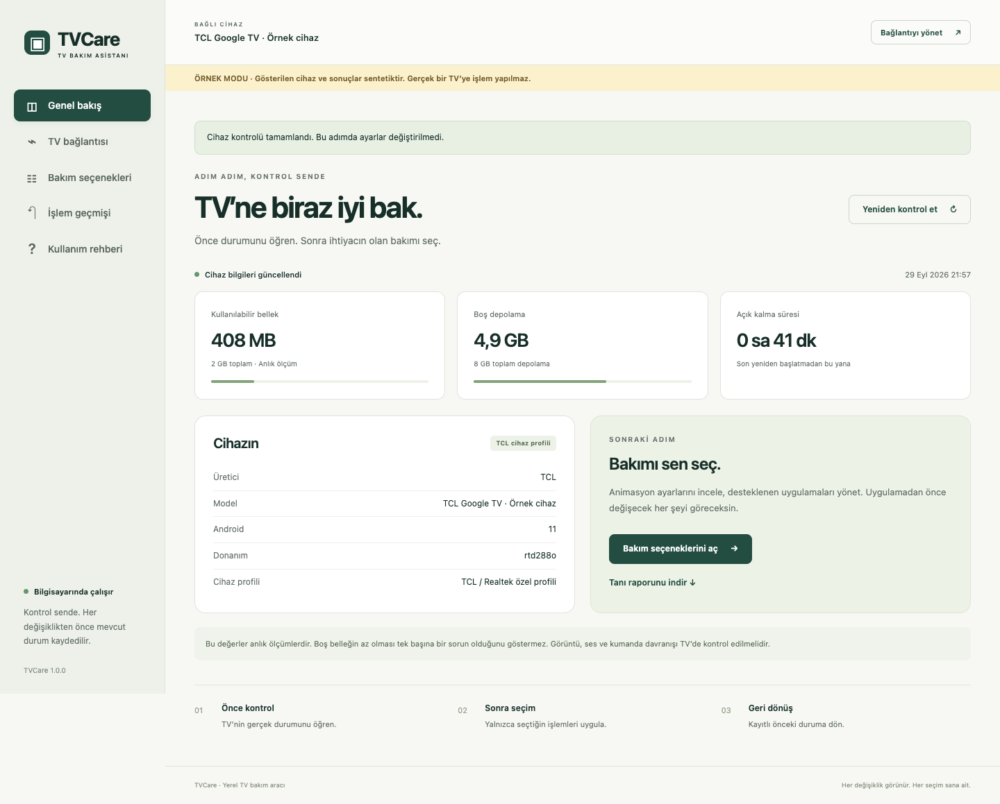

# TVCare

**A local maintenance tool for Android TV and Google TV.** Inspect your TV, choose changes, review the plan, and apply only what you approve. Runs on your computer with a browser interface. No AI account, subscription, or cloud service required.

**1.0.0 Public Preview:** An initial public prerelease. Review the compatibility and validation limits below.

[Download](https://github.com/paylanovic/TVCare/releases/tag/v1.0.0) · [Türkçe](README.md)



*The screenshot shows synthetic demo data, not results from a physical TV. The application interface is currently Turkish.*

## Get started in three steps

1. **Download and extract.** Open the TVCare 1.0.0 release’s [Assets section](https://github.com/paylanovic/TVCare/releases/tag/v1.0.0) and select the ZIP matching your operating system and CPU. Extract the entire archive; do not run it inside the ZIP. Ready-made packages do not require Python. Only use assets actually listed in the release; see its notes for available builds and verification status.
2. **Add ADB and launch.** Download your operating system’s ZIP from [Google’s official Android Platform Tools page](https://developer.android.com/tools/releases/platform-tools). Extract it and place the `platform-tools` folder next to the `TVCare` / `TVCare.exe` executable. ADB is not included in the default TVCare package. Start the launcher below; TVCare detects ADB and opens your browser. Keep the terminal open while using it.
3. **Connect and review.** Put your TV and computer on the same local network. Enable the TV’s developer options and supported debugging method. Open **TV bağlantısı** in TVCare, follow the instructions, approve your computer on the TV, and choose **Seç ve kontrol et**. Select maintenance options, review the before/after values, then confirm. Inspection itself does not change settings.

| Operating system | ZIP name includes | Launcher |
|---|---|---|
| Windows | `windows` | `Start-TVCare.cmd` |
| macOS | `darwin` | `TVCare.command` |
| Linux | `linux` | `TVCare.sh` |

macOS packages are not Apple-notarized; Windows packages are not signed with a publisher certificate. The [Turkish quick-start guide](docs/QUICKSTART.md) includes detailed connection instructions.

## Features and compatibility

- Inspect available memory, storage, uptime, and accessible error indicators.
- Adjust animation duration; enable or disable recognized optional applications.
- Choose between compatible launchers and screensavers already installed on the TV.
- Review every change, inspect transaction history, and prepare a rollback plan.
- Export a reduced JSON support report for review before sharing.
- Optionally install a shutdown-lock guard on the explicitly supported TCL profile when the required fault evidence is present.

**Requires Android TV / Google TV and authorized ADB access. Samsung Tizen and LG webOS are not supported.** Network ADB support varies by device. Maintenance requires a verified TV identity and its primary Android user profile. Unknown and essential packages are protected. TVCare does not root devices, flash firmware, or factory-reset them.

The shutdown guard is specific to TCL BeyondTV4 / RTD288O / Android 11 and its verified fault conditions. It is not a general freezing fix or firmware repair. Debugging must remain enabled while the guard is in use. See [device support](docs/DEVICE_SUPPORT.md).

## Rollback, privacy, and validation

Before writing, TVCare records the previous value; afterward it reads the result back. Rollback restores only recorded values whose current state can be verified. It is **not a complete device backup**, and later conflicting changes are not silently overwritten.

The interface runs locally. There is no telemetry or automatic report upload. Use the in-app reduced report for support, and review its contents before sharing. Never publish raw logs, device IP addresses, serial numbers, connection tokens, ADB keys, or your complete application data folder.

The new maintenance flows have not completed physical-TV acceptance testing. Automated checks and demo runs do not establish hardware compatibility. See the [verification record](docs/VERIFICATION.md) for current evidence.

## Try it without a TV

From the extracted package directory:

```sh
# macOS / Linux
./TVCare --demo
```

```powershell
# Windows PowerShell
.\TVCare.exe --demo
```

Demo mode uses a synthetic device, never connects through real ADB, and displays an **ÖRNEK MODU** banner.

## Run from source

Requires Python **3.10+**. There are no third-party Python runtime dependencies.

```sh
git clone https://github.com/paylanovic/TVCare.git
cd TVCare
python3 -m tvbakim
```

On Windows, use `py -3 -m tvbakim` for the last command. Place `platform-tools` beside this README. Add `--demo` to try the synthetic device.

```sh
python3 -m unittest discover -s tests -v
node --check tvbakim/static/app.js
```

[Report an issue](https://github.com/paylanovic/TVCare/issues/new/choose) · [Architecture](docs/ARCHITECTURE.md) · [Distribution](docs/DISTRIBUTION.md)

## License

TVCare is provided under the [MIT license](LICENSE). Separately downloaded components, including Android Platform Tools, retain their own licenses.

Packaged releases also include a one-click demo launcher: `Demo-TVCare.command` (macOS), `Demo-TVCare.cmd` (Windows), or `Demo-TVCare.sh` (Linux). It does not require ADB or a real TV.
